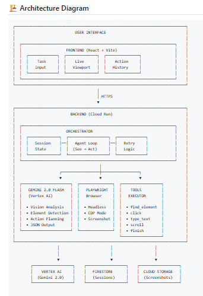

# UI Navigator 🤖

**Your AI Hands on Screen**

A powerful AI agent that becomes your hands on screen. It observes the browser display using Gemini multimodal vision, interprets visual elements without relying on DOM access, and performs actions based on user intent.

---

## 👤 Developer

- **GitHub**: https://github.com/ssewanyana-nicholas
- **GDG Profile**: https://gdg.community.dev/u/mjuu9y/#/about

---

## 🎯 Competition Submission

### 📃 Text Description

UI Navigator is a Visual UI Understanding & Interaction Agent that uses Gemini 2.0 Flash multimodal vision to interpret screenshots and execute browser actions via Playwright. The agent "sees" the browser display, understands visual elements without DOM access, and performs actions based on user intent - essentially becoming "hands on screen" for the user.

**Key Features:**
- Visual UI Understanding via Gemini 2.0 Flash
- Executable Actions (click, type, scroll, navigate)
- Multiple Modes: Headless, CDP (control your browser), Analysis-only
- Session Management with Firestore persistence
- Screenshot Storage in Cloud Storage

**Technologies Used:**
- **AI**: Gemini 2.0 Flash via Google GenAI SDK
- **Frontend**: React 19 + Vite + Tailwind CSS
- **Backend**: Node.js + Express + Playwright
- **Cloud**: Vertex AI, Cloud Run, Cloud Storage, Firestore

### 👨‍💻 Code Repository

**Public URL**: https://github.com/ssewanyana-nicholas/universal-workflow-agent-

### 🖥️ Proof of Google Cloud Deployment

**Live Demo:**
- **Frontend**: https://storage.googleapis.com/my-universal-workflow-agent-frontend/index.html
- **Backend API**: https://workflow-agent-backend-608289224046.us-central1.run.app
- **Health Check**: https://workflow-agent-backend-608289224046.us-central1.run.app/health

**Proof of Google Cloud Deployment:**
The project includes a [`deploy.sh`](deploy.sh) script that automates the entire deployment process:

```bash
# Deploy everything with one command
./deploy.sh
```

The script:
1. Builds and deploys backend to Cloud Run (source-based, no Docker needed)
2. Builds frontend with Vite
3. Syncs frontend to Cloud Storage bucket
4. Configures static website hosting
5. Sets proper IAM permissions for public access

**Code Proof - Google Cloud APIs:**
See the Gemini integration code that calls Vertex AI:
- 📄 [`backend/src/gemini.js`](backend/src/gemini.js) - Vertex AI API calls with Gemini 2.0 Flash
- 📄 [`backend/src/util/storage.js`](backend/src/util/storage.js) - Cloud Storage API for screenshots
- 📄 [`backend/src/util/state.js`](backend/src/util/state.js) - Firestore API for session storage

**Example API call in code:**
```javascript
const vertexAI = new VertexAI({ project: config.projectId, location: config.location });
const generativeModel = vertexAI.preview.getGenerativeModel({
    model: 'gemini-2.0-flash',
    systemInstruction: { role: 'system', parts: [{ text: systemInstruction }] },
});
```

**GCP Services Used:**
- ✅ Vertex AI (Gemini 2.0 Flash)
- ✅ Cloud Run (Backend deployment)
- ✅ Cloud Storage (Static website hosting + screenshots)
- ✅ Firestore (Session history)
- ✅ Cloud Logging

**GCP Console Proof:**
```
gcloud run services list --region us-central1
SERVICE                  REGION       URL
workflow-agent-backend   us-central1  https://workflow-agent-backend-608289224046.us-central1.run.app
```

---

## 🏗️ Architecture Diagram



```
┌─────────────────────────────────────────────────────────────────────────────┐
│                           USER INTERFACE                                    │
│                                                                             │
│  ┌─────────────────────────────────────────────────────────────────────┐    │
│  │                    FRONTEND (React + Vite)                          │    │
│  │  ┌─────────────┐  ┌──────────────┐  ┌───────────────┐               │    │
│  │  │    Task     │  │    Live      │  │    Action     │               │    │
│  │  │   Input     │  │   Viewport   │  │   History     │               │    │
│  │  └─────────────┘  └──────────────┘  └───────────────┘               │    │
│  └─────────────────────────────────────────────────────────────────────┘    │
└─────────────────────────────────────────────────────────────────────────────┘
                                      │
                                      │ HTTPS
                                      ▼
┌─────────────────────────────────────────────────────────────────────────────┐
│                         BACKEND (Cloud Run)                                 │
│                                                                             │
│  ┌─────────────────────────────────────────────────────────────────────┐    │
│  │                    ORCHESTRATOR                                     │    │
│  │  ┌──────────────┐  ┌──────────────────┐  ┌─────────────┐            │    │
│  │  │   Session    │──│   Agent Loop     │──│   Retry     │            │    │
│  │  │   State      │  │  (See → Act)     │  │   Logic     │            │    │
│  │  └──────────────┘  └──────────────────┘  └─────────────┘            │    │
│  └─────────────────────────────────────────────────────────────────────┘    │
│                                      │                                      │
│                    ┌─────────────────┼─────────────────┐                    │
│                    ▼                 ▼                 ▼                    │
│  ┌──────────────────────┐  ┌───────────────┐  ┌──────────────────┐          │
│  │   GEMINI 2.0 FLASH   │  │   PLAYWRIGHT  │  │    TOOLS         │          │
│  │   (Vertex AI)        │  │   Browser     │  │   EXECUTOR       │          │
│  │                      │  │               │  │                  │          │
│  │  • Vision Analysis   │  │  • Headless   │  │  • find_element  │          │
│  │  • Element Detection │  │  • CDP Mode   │  │  • click         │          │
│  │  • Action Planning   │  │  • Screenshot │  │  • type_text     │          │
│  │  • JSON Output       │  │               │  │  • scroll        │          │
│  └──────────────────────┘  └───────────────┘  │  • finish        │          │
│                                               └──────────────────┘          │
└─────────────────────────────────────────────────────────────────────────────┘
                    │                       │                   │
                    │                       │                   │
                    ▼                       ▼                   ▼
        ┌──────────────────┐    ┌──────────────────┐    ┌──────────────────┐
        │    VERTEX AI     │    │   FIRESTORE      │    │  CLOUD STORAGE   │
        │  (Gemini 2.0)    │    │   (Sessions)     │    │  (Screenshots)   │
        └──────────────────┘    └──────────────────┘    └──────────────────┘

```

---

## ✅ Requirements Compliance

### Mandatory Tech Requirements

| Requirement | Status | Implementation |
|-------------|--------|----------------|
| **Gemini Model** | ✅ | Uses `gemini-2.0-flash` via Google GenAI SDK (`@google-cloud/vertexai`) |
| **Google GenAI SDK** | ✅ | `import { VertexAI } from '@google-cloud/vertexai'` in [`backend/src/gemini.js`](backend/src/gemini.js) |
| **Multimodal Vision** | ✅ | Screenshots analyzed with Gemini 2.0 Flash for visual UI understanding |
| **Executable Actions** | ✅ | Agent outputs executable tool calls (click, type, find_element, etc.) |
| **ADK Agent** | ✅ | ADK-style agent implementation in [`backend/src/adk_agent.js`](backend/src/adk_agent.js) |

### Google Cloud Services

| Service | Status | Implementation |
|---------|--------|----------------|
| **Vertex AI** | ✅ | Gemini 2.0 Flash for vision and reasoning |
| **Cloud Run** | ✅ | Deployable to Cloud Run (Dockerfile included) |
| **Cloud Logging** | ✅ | Pino logger with structured logging |
| **Firestore** | ✅ | Session history storage ([`backend/src/util/state.js`](backend/src/util/state.js)) |
| **Cloud Storage** | ✅ | Screenshot storage ([`backend/src/util/storage.js`](backend/src/util/storage.js)) |

---

## 🚀 Spin-Up Instructions (For Judges)

### Prerequisites
- Node.js 20+
- Google Cloud Project with Vertex AI enabled
- gcloud CLI installed

### Option 1: Automated Deployment (One Command)

```bash
# Clone and deploy everything with one command
git clone https://github.com/ssewanyana-nicholas/universal-workflow-agent-
cd universal-workflow-agent-
./deploy.sh
```

The deploy.sh script will:
1. Build and deploy backend to Cloud Run
2. Build frontend with Vite
3. Sync frontend to Cloud Storage
4. Configure static website hosting
5. Output the final URLs

### Option 2: Manual Local Development

```bash
# 1. Clone the repository
git clone https://github.com/ssewanyana-nicholas/universal-workflow-agent-
cd universal-workflow-agent-

# 2. Configure backend
cp backend/.env.sample backend/.env
# Edit backend/.env with your Google Cloud project settings

# 3. Install dependencies
cd backend && npm install
cd ../frontend && npm install

# 4. Start the backend
cd backend && npm start
# Backend runs on http://localhost:8080

# 5. Start the frontend (in another terminal)
cd frontend && npm run dev
# Frontend runs on http://localhost:3000
```

### Configuration

Create `backend/.env`:
```env
GOOGLE_CLOUD_PROJECT=your-project-id
GCP_LOCATION=us-central1
GCS_BUCKET=your-screenshots-bucket
FIRESTORE_COLLECTION=uia_sessions
PORT=8080
```

### Deploy to Google Cloud

```bash
# Deploy backend to Cloud Run
cd backend
gcloud run deploy workflow-agent-backend \
  --source . \
  --platform managed \
  --region us-central1 \
  --allow-unauthenticated \
  --set-env-vars GOOGLE_CLOUD_PROJECT=your-project-id

# Build and sync frontend to Cloud Storage
cd frontend
npm run build
gsutil -m rsync -R dist gs://your-frontend-bucket
```

---

## 🧪 Reproducible Testing Instructions

### Option 1: Test Live Demo (No Setup Required)

1. Open the frontend: https://storage.googleapis.com/my-universal-workflow-agent-frontend/index.html
2. Enter a URL (e.g., https://google.com)
3. Enter a task (e.g., "Search for the president of Kenya")
4. Click "Start Agent"
5. Watch the agent navigate and complete the task in real-time

### Option 2: Test API Directly

```bash
# Test health endpoint
curl https://workflow-agent-backend-608289224046.us-central1.run.app/health

# Test GCP proof endpoint
curl https://workflow-agent-backend-608289224046.us-central1.run.app/proof/gcp

# Test agent run endpoint
curl -X POST https://workflow-agent-backend-608289224046.us-central1.run.app/agent/run \
  -H "Content-Type: application/json" \
  -d '{
    "url": "https://google.com",
    "task": "Search for AI",
    "viewport": {"width": 1280, "height": 720}
  }'
```

### Option 3: Run Locally

```bash
# 1. Clone the repo
git clone https://github.com/ssewanyana-nicholas/universal-workflow-agent-
cd universal-workflow-agent-

# 2. Configure backend
cp backend/.env.sample backend/.env
# Edit with your GCP project settings

# 3. Install dependencies
cd backend && npm install
cd ../frontend && npm install

# 4. Start backend (terminal 1)
cd backend && npm start

# 5. Start frontend (terminal 2)
cd frontend && npm run dev

# 6. Open http://localhost:3000
```

### Option 4: Deploy to Your GCP

```bash
# One-command deployment
./deploy.sh
```

---

## 💡 Example Tasks

| Task | What the agent does |
|------|---------------------|
| "Search for the president of Kenya" | Opens Google → Types query → Shows results |
| "Find weather in Nairobi" | Navigates to weather site → Reports weather |
| "Go to wikipedia.org and find info about AI" | Opens Wikipedia → Navigates to AI page |

---

## 📁 Project Structure

```
universal-workflow-agent/
├── deploy.sh                 # Main deployment automation script
├── backend/                 # Express + Node.js backend
│   ├── deploy.sh          # Backend-specific deployment
│   ├── Dockerfile          # Cloud Run container definition
│   └── src/
│       ├── gemini.js      # Gemini 2.0 Flash integration
│       ├── orchestrator.js # Agent workflow loop
│       ├── adk_agent.js   # ADK-style agent
│       ├── browser.js     # Playwright browser control
│       └── server.js      # Express API server
├── frontend/               # React + Vite frontend
│   ├── src/
│   │   └── App.tsx       # Main React application
│   └── vite.config.ts
└── README.md               # This file
```

---

## 🔧 Key Technical Decisions

1. **Vision-Based Approach**: Instead of parsing DOM, we use Gemini to "see" screenshots - works on any website regardless of framework

2. **Playwright for Browser Control**: Robust browser automation that works in containers

3. **Cloud Run for Backend**: Auto-scaling containerized backend with zero infrastructure management

4. **Session Persistence**: Firestore stores session history for recovery and audit trails

---

## 📜 License

Apache 2.0
